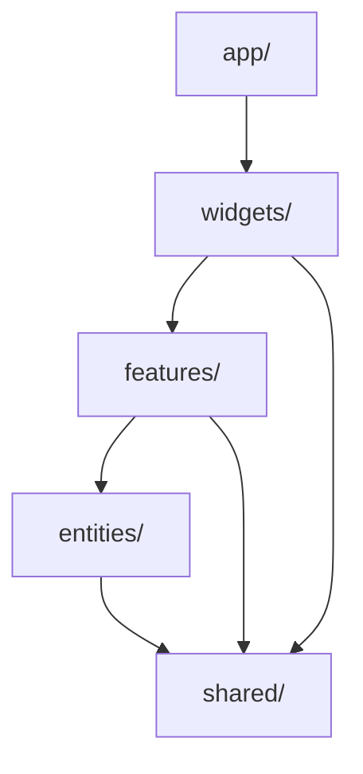

# 🏙️ UrbanAnalytics

> Платформа градостроительного анализа данных с клиентским SQL-движком, иерархическими фильтрами и интерактивной визуализацией.


## 📋 Оглавление

- [О проекте](#-о-проекте)
- [Архитектура](#-архитектура)
- [Технологический стек](#-технологический-стек)
- [Структура проекта](#-структура-проекта)
- [Быстрый старт](#-быстрый-старт)
- [Основные возможности](#-основные-возможности)
- [Сценарии использования](#-сценарии-использования)
- [Вычислительный движок](#-вычислительный-движок)
- [Безопасность](#-безопасность)
- [Конфигурация](#-конфигурация)
- [Разработка](#-разработка)
- [Деплой](#-деплой)
- [Лицензия](#-лицензия)

---

## 🎯 О проекте

**UrbanAnalytics** — это полнофункциональное веб-приложение для анализа данных, которое позволяет:

- 📊 **Загружать данные** из Excel/CSV файлов или PostgreSQL баз данных
- 🔧 **Настраивать структуру** — классифицировать колонки (числовые, категориальные, даты)
- 🌳 **Строить иерархии** — многоуровневая вложенность (Страна → Регион → Город)
- 🧮 **Создавать метрики** — агрегации (SUM, AVG, COUNT...) и формулы на math.js
- 👥 **Формировать группы показателей** — логические блоки (строки таблицы)
- 📈 **Строить дашборды** — сводные таблицы + KPI-карточки + графики
- 🔍 **Drill-down** — интерактивное погружение по иерархии
- 💾 **Экспорт/импорт** — перенос конфигурации между датасетами
- 🎨 **Условное форматирование** — цветовые правила для значений

Все вычисления происходят **клиентски** (DuckDB-WASM в Web Worker) или на сервере (PostgreSQL через Server Actions). Данные Excel хранятся как Apache Arrow buffers в IndexedDB.

---

## 🏛️ Архитектура

Проект построен по архитектуре **[Feature-Sliced Design (FSD)](https://feature-sliced.design/)**:

```
┌─────────────────────────────────────────────────────────────┐
│                        app/ (Next.js 16 App Router)         │
│  Маршруты: /dashboards, /groups, /setup, /hierarchy, ...   │
├─────────────────────────────────────────────────────────────┤
│                     widgets/ (UI-блоки)                     │
│  dashboard-view, group-view, setup-wizard, charts-section  │
├─────────────────────────────────────────────────────────────┤
│                    features/ (сценарии)                     │
│  create-dashboard, delete-group, config-persistence, ...   │
├─────────────────────────────────────────────────────────────┤
│                    entities/ (сущности)                     │
│  dataset, dashboard, metric, indicatorGroup, hierarchy     │
├─────────────────────────────────────────────────────────────┤
│                      shared/ (общее)                        │
│  computation-engine, api, ui-kit, types, utils, validators │
└─────────────────────────────────────────────────────────────┘
```

**Правило зависимостей:** каждый слой может импортировать только нижележащие. `shared` не зависит ни от чего.

### Диаграмма слоёв



---

## 🛠️ Технологический стек

| Категория         | Технология                 | Назначение                              |
| ----------------- | -------------------------- | --------------------------------------- |
| **Framework**     | Next.js 16 (App Router)    | SSR, Server Actions, маршрутизация      |
| **Language**      | TypeScript 5               | Строгая типизация                       |
| **State**         | Zustand + persist          | Глобальное состояние с персистентностью |
| **Client DB**     | DuckDB-WASM                | SQL-движок в Web Worker                 |
| **Server DB**     | PostgreSQL + postgres.js   | Серверный источник данных               |
| **Data Format**   | Apache Arrow               | Бинарный формат для данных              |
| **Formulas**      | Math.js                    | Парсинг и вычисление формул             |
| **SQL Compiler**  | Кастомный (formula-to-sql) | MathJS AST → SQL                        |
| **Charts**        | Recharts                   | Визуализация (бары, радар)              |
| **UI Kit**        | Radix UI                   | Dialog, Popover, доступность            |
| **DnD**           | @dnd-kit                   | Drag-and-drop списки                    |
| **Styling**       | Tailwind CSS v4            | Utility-first стилизация                |
| **Theming**       | next-themes                | Dark/Light/System темы                  |
| **Validation**    | Zod                        | Runtime валидация данных                |
| **Storage**       | idb-keyval                 | IndexedDB wrapper                       |
| **Notifications** | Sonner                     | Toast-уведомления                       |
| **Icons**         | Lucide React               | Иконки                                  |
| **ID generation** | nanoid                     | Генерация уникальных ID                 |

---

## 📁 Структура проекта

```
urban-analytics/
├── app/                          # Next.js App Router маршруты
│   ├── dashboards/
│   │   ├── page.tsx              # Список дашбордов
│   │   ├── new/page.tsx          # Создание дашборда
│   │   └── [id]/
│   │       ├── page.tsx          # Просмотр дашборда
│   │       ├── edit/page.tsx     # Редактирование
│   │       └── loading.tsx
│   ├── groups/
│   │   ├── page.tsx              # Список групп
│   │   ├── new/page.tsx          # Создание группы
│   │   └── [id]/
│   │       ├── page.tsx          # Просмотр группы (drill-down)
│   │       └── edit/page.tsx     # Редактирование
│   ├── setup/page.tsx            # Мастер настройки (данные + колонки)
│   ├── hierarchy/page.tsx        # Настройка иерархии
│   ├── metrics/page.tsx          # Шаблоны метрик
│   ├── settings/page.tsx         # Настройки (экспорт/импорт/сброс)
│   ├── layout.tsx                # Корневой layout
│   ├── providers/
│   │   ├── client-layout.tsx     # Sidebar + гидрация сторов
│   │   ├── hydration.ts          # Восстановление Zustand из IDB
│   │   └── index.tsx             # ThemeProvider
│   ├── globals.css               # Tailwind v4 + кастомные утилиты
│   ├── error.tsx                 # Error boundary
│   └── not-found.tsx             # 404
│
├── entities/                     # Бизнес-сущности (Zustand stores)
│   ├── dataset/                  # Источник данных
│   │   ├── model/
│   │   │   ├── store.ts          # useDatasetStore
│   │   │   ├── sync-engine.ts    # Импорт из file/PG
│   │   │   ├── types.ts
│   │   │   └── use-file-import.ts
│   │   └── lib/type-mapper.ts    # PG type → classification
│   ├── dashboard/                # Дашборд
│   │   └── model/
│   │       ├── store.ts          # useDashboardStore
│   │       ├── types.ts
│   │       └── use-dashboard-filters.ts
│   ├── metric/                   # Шаблоны метрик + вычисления
│   │   ├── model/
│   │   │   ├── template-store.ts # useMetricTemplateStore
│   │   │   ├── computed-store.ts # Кэш результатов
│   │   │   └── types.ts
│   │   ├── lib/flatten-dashboard-result.ts
│   │   └── ui/metric-cell.tsx    # Умная ячейка с условным форматированием
│   ├── indicatorGroup/           # Группа показателей
│   │   └── model/store.ts        # useIndicatorGroupStore
│   ├── hierarchy/                # Уровни иерархии
│   │   ├── model/
│   │   │   ├── store.ts          # useHierarchyStore
│   │   │   └── types.ts
│   │   └── lib/
│   │       ├── hierarchy-client.ts
│   │       └── hooks/
│   │           ├── use-hierarchy-tree.ts
│   │           └── use-hierarchy-level-nodes.ts
│   ├── columnConfig/             # Конфиги колонок
│   │   └── model/column-store.ts # useColumnConfigStore
│   ├── groupMetricConfig/        # UI-настройки метрик групп
│   │   ├── model/store.ts        # useGroupMetricConfigStore
│   │   └── ui/GroupMetricCell.tsx
│   ├── formula/                  # Валидация формул
│   │   ├── lib/hooks/use-formula-validation.ts
│   │   └── model/
│   ├── exportPackage/types.ts    # Формат экспорта конфигурации
│   └── groupView/lib/            # Хелперы для group-view
│
├── features/                     # Пользовательские сценарии
│   ├── create-dashboard/         # Создание дашборда
│   ├── create-group/             # Создание группы
│   ├── CreateMetricTemplate/     # Форма шаблона метрики
│   ├── edit-dashboard/           # Редактирование дашборда
│   ├── edit-group/               # Редактирование группы
│   ├── delete-dashboard/         # Удаление дашборда
│   ├── delete-group/             # Удаление группы (с каскадной очисткой)
│   ├── AddKpiWidget/             # Добавление KPI-карточки
│   ├── ConfigureTableMetric/     # Настройка условного форматирования
│   ├── ConfigureGroupMetric/    # Настройка цвета метрики группы
│   ├── DatasetSourceSelector/    # Выбор источника (file/PG)
│   ├── setup-dataset/
│   │   └── model/
│   │       ├── use-dataset-manager.ts
│   │       ├── use-dataset-replace.ts
│   │       └── use-dashboard-filter-reconciler.ts
│   ├── config-persistence/       # Экспорт/импорт конфигурации
│   │   └── model/use-config-persistence.ts
│   ├── hierarchy-filters/        # Действия с фильтрами иерархии
│   └── system-reset/             # Полный сброс системы
│
├── widgets/                      # Композиционные UI-блоки
│   ├── dashboard-view/           # Страница просмотра дашборда
│   │   ├── model/
│   │   │   ├── use-dashboard-computation.ts
│   │   │   ├── use-dashboard-dataset-sync.ts
│   │   │   ├── use-dashboard-orphan-cleanup.ts
│   │   │   └── use-dashboard-view-state.ts
│   │   └── ui/
│   │       ├── DashboardViewWidget.tsx    # Публичная точка входа
│   │       ├── DashboardViewContent.tsx   # Приватный оркестратор
│   │       ├── DashboardHeader.tsx
│   │       ├── DashboardStats.tsx
│   │       ├── DashboardNotFound.tsx
│   │       ├── DatasetStatusBadge.tsx
│   │       └── DatasetUnavailable.tsx
│   ├── group-view/               # Страница просмотра группы
│   │   ├── model/
│   │   │   ├── use-group-breakdown.ts
│   │   │   └── use-group-view-state.ts
│   │   ├── lib/sort-breakdown.ts
│   │   └── ui/
│   │       ├── GroupViewWidget.tsx
│   │       ├── GroupViewContent.tsx
│   │       ├── GroupBreakdownTable.tsx
│   │       ├── GroupKpiGrid.tsx
│   │       ├── GroupKpiCard.tsx
│   │       ├── GroupChartsPanel.tsx
│   │       ├── GroupPageHeader.tsx
│   │       ├── ChartTypeSelector.tsx
│   │       └── Chart/
│   │           ├── GroupBarChart.tsx
│   │           └── GroupRadarChart.tsx
│   ├── setup-wizard/             # Мастер настройки
│   │   ├── model/
│   │   │   ├── use-setup-wizard.ts
│   │   │   └── use-setup-wizard-actions.ts
│   │   └── ui/
│   ├── dashboard-builder/        # Конструктор дашборда
│   ├── group-builder/            # Конструктор группы
│   ├── dashboard-list/           # Список дашбордов
│   ├── group-list/               # Список групп
│   ├── dashboard-metrics-table/  # Таблица метрик дашборда
│   ├── charts-section/           # Визуализация (бары + радар)
│   ├── hierarchy-builder/        # Настройка иерархии
│   ├── hierarchy-filter/         # Дерево иерархии (sidebar)
│   ├── kpi-grid/                 # Сетка KPI-карточек
│   ├── column-manager/           # Настройка типов колонок
│   ├── raw-data-viewer/          # Просмотр сырых данных
│   ├── data-table-viewer/        # Универсальный просмотрщик таблиц
│   ├── dataset-switcher/         # Переключатель датасетов
│   ├── file-uploader/            # Загрузка Excel/CSV
│   ├── postgres-connection-form/ # Форма подключения к PG
│   ├── postgres-table-browser/   # Выбор таблицы из PG
│   ├── formula-builder/          # Визуальный конструктор формул
│   ├── template-manager/         # Управление шаблонами метрик
│   ├── metrics-manager/          # Страница метрик
│   ├── settings/                 # Страница настроек
│   ├── sidebar/                  # Боковое меню
│   ├── mobile-nav/               # Мобильная навигация
│   └── shared/
│       └── model/
│           ├── use-computation.ts        # Единый хук вычислений
│           └── use-engine-status.ts      # Статус DuckDB worker'а
│
├── shared/                       # Общие ресурсы
│   ├── api/
│   │   ├── postgres/
│   │   │   └── client.ts         # postgres.js client
│   │   └── server-actions/
│   │       ├── postgres.ts       # testPgConnection, getPgSchema, fetchPgTableData
│   │       └── pg-compute.ts     # computePgMetrics
│   ├── lib/
│   │   ├── computation/
│   │   │   ├── lib/
│   │   │   │   ├── duckdb/
│   │   │   │   │   ├── engine.ts           # DuckDbEngine (IComputeEngine)
│   │   │   │   │   ├── manager.ts          # DuckDBWorkerManager
│   │   │   │   │   ├── worker.ts           # Web Worker (DuckDB-WASM)
│   │   │   │   │   ├── arrow-converter.ts  # DatasetRow ↔ Arrow
│   │   │   │   │   ├── chunked-export.ts   # Chunked export для 1M+ строк
│   │   │   │   │   ├── excel-parser.ts     # Excel/CSV → JSON
│   │   │   │   │   ├── table-name.ts       # Детерминированные имена таблиц
│   │   │   │   │   └── prepared-statement-cache.ts  # LRU-кэш
│   │   │   │   ├── postgres/
│   │   │   │   │   └── engine.ts           # PgEngine (IComputeEngine)
│   │   │   │   ├── engine-factory.ts       # Фабрика движков
│   │   │   │   ├── query-compiler.ts       # ClientComputeParams → SQL
│   │   │   │   ├── formula-to-sql.ts       # MathJS AST → SQL
│   │   │   │   ├── kpi-compiler.ts         # KPI → compute params
│   │   │   │   ├── post-process.ts         # Вычисление calculated-метрик
│   │   │   │   ├── aggregation.ts          # Агрегация для сводной строки
│   │   │   │   ├── types.ts                # Контракты движка
│   │   │   │   └── utils.ts                # formatValue, getActiveFilter
│   │   ├── services/                 # Чистые application-level сервисы
│   │   │   ├── column-config-merger.ts     # Мерж конфигов при замене файла
│   │   │   ├── config-export-service.ts    # Построение export payload
│   │   │   ├── config-import-service.ts    # Импорт + валидация + дедупликация
│   │   │   └── dashboard-filter-reconciler.ts  # Согласование фильтров
│   │   ├── storage/
│   │   │   ├── computation-cache.ts  # FileComputationCache, PgComputationCache
│   │   │   ├── migration.ts          # Фабрика миграций Zustand
│   │   │   └── types.ts
│   │   ├── math/
│   │   │   └── safe-math.ts          # Безопасный mathjs + валидация AST
│   │   ├── types/                    # Контракты между слоями
│   │   │   ├── computation.ts        # DashboardComputationResult
│   │   │   ├── dataset.ts            # DatasetRow, ColumnConfig
│   │   │   ├── hierarchy.ts
│   │   │   ├── dashboard.ts
│   │   │   ├── chart.ts
│   │   │   └── next.ts               # DynamicPageProps
│   │   ├── utils/
│   │   │   ├── crypto.ts             # AES-GCM для PG-конфигов
│   │   │   ├── hash.ts               # Детерминированные хеши
│   │   │   ├── metric-ids.ts         # VM ID генерация
│   │   │   ├── metric-colors.ts      # Палитра + checkRule
│   │   │   ├── formatting-rules.ts
│   │   │   ├── thresholds.ts         # Группировка порогов
│   │   │   ├── formula.ts            # extractVariables
│   │   │   ├── format.ts             # formatCompactNumber
│   │   │   └── translit.ts           # Транслитерация
│   │   ├── hooks/
│   │   │   ├── use-url-filters.ts
│   │   │   ├── use-group-path.ts
│   │   │   ├── use-hover-popup.ts
│   │   │   └── use-threshold-grouping.ts
│   │   └── validators.ts             # Zod-схемы
│   └── ui/                           # Переиспользуемые UI-компоненты
│       ├── button.tsx, input.tsx, card.tsx, badge.tsx
│       ├── dialog.tsx, confirm-dialog.tsx
│       ├── searchable-select.tsx, select.tsx
│       ├── drag-drop-list/            # Generic DnD-лист
│       ├── rule-card/                 # Карточка правила форматирования
│       ├── threshold-marker/          # Пороговые маркеры на графиках
│       ├── engine-gate.tsx            # Gate-компонент для движка
│       ├── error-boundary.tsx
│       ├── client-only.tsx
│       ├── loading-screen.tsx
│       ├── theme-toggle/
│       ├── sort-icon.tsx
│       └── toast.ts
│
├── public/
│   └── duckdb/                   # WASM-файлы DuckDB
│       ├── duckdb-eh.wasm
│       ├── duckdb-mvp.wasm
│       ├── duckdb-browser-eh.worker.js
│       └── duckdb-browser-mvp.worker.js
│
├── package.json
├── tsconfig.json
├── tailwind.config.ts
├── next.config.mjs
└── README.md
```

---

## 🚀 Быстрый старт

### Требования

- **Node.js** 20+
- **npm** или **pnpm**
- (Опционально) **PostgreSQL** 14+ для серверного источника данных

### Установка

```bash
# 1. Клонировать репозиторий
git clone https://github.com/your-org/urban-analytics.git
cd urban-analytics

# 2. Установить зависимости
npm install

# 3. Запустить dev-сервер
npm run dev
```

Приложение будет доступно по адресу **http://localhost:3000**.

### Первый запуск

1. Откройте `/setup`
2. Загрузите Excel/CSV файл **или** подключитесь к PostgreSQL
3. Настройте типы колонок (numeric / categorical / date / ignore)
4. Перейдите на `/hierarchy` и настройте уровни вложенности
5. Создайте шаблоны метрик на `/metrics`
6. Создайте группы показателей на `/groups/new`
7. Соберите дашборд на `/dashboards/new`
8. Откройте дашборд для интерактивного анализа

### Скрипты

```bash
npm run dev          # Dev-сервер (http://localhost:3000)
npm run build        # Production-сборка
npm run start        # Запуск production-сборки
npm run lint         # ESLint
```

---

## ✨ Основные возможности

### 📊 Источники данных

| Источник | Лимит | Хранение | Обновление |
|---|---|---|---|
| **Excel/CSV** | 1M+ строк (chunked) | Arrow buffer в IndexedDB | Замена файла (сохраняет конфиги) |
| **PostgreSQL** | 50 000 строк | Сервер БД | Кнопка "Обновить" в UI |

### 🧮 Метрики

**Агрегации:**
- `SUM`, `AVG`, `COUNT`, `COUNT_DISTINCT`
- `MIN`, `MAX`, `MEDIAN`, `PERCENTILE`

**Формулы (Math.js):**
- Арифметика: `+`, `-`, `*`, `/`, `%`, `^`
- Функции: `ROUND`, `ABS`, `SQRT`, `POW`, `LOG`, `EXP`
- Условия: `IF(cond, then, else)`
- Сравнения: `>`, `<`, `>=`, `<=`, `==`, `!=`
- Ссылки на другие метрики (с топологической сортировкой)

**Безопасность формул:**
- Whitelist разрешённых функций
- Блокировка опасных переменных (`process`, `eval`, `require`, ...)
- AST-валидация через `safe-math.ts`

### 🎨 Условное форматирование

- Операторы: `>`, `>=`, `<`, `<=`, `==`, `!=`, `between`
- 6 цветов: emerald, rose, amber, blue, indigo, slate
- Правила применяются **сверху вниз** (drag-and-drop сортировка)
- Первое совпавшее правило «побеждает»

### 📈 Визуализация

- **BarChart** — столбчатая диаграмма с conditional fill
- **RadarChart** — радарная диаграмма с conditional dots
- **ReferenceLine** — пороговые линии с интерактивными маркерами
- **ThresholdPopup** — hover-popup с детализацией правил
- **ThresholdLegend** — компактная легенда порогов

---

## 🎬 Сценарии использования

### Сценарий 1: Анализ данных из Excel

```
1. /setup → Загрузить .xlsx файл
2. /setup (step: columns) → Классифицировать колонки
3. /hierarchy → Настроить уровни (например: Округ → Район → Школа)
4. /metrics → Создать шаблон "Средняя оценка" (AVG)
5. /groups/new → Создать группу "Образование" с метриками
6. /dashboards/new → Собрать дашборд
7. /dashboards/:id → Drill-down по иерархии
```

### Сценарий 2: Подключение к PostgreSQL

```
1. /setup → PostgreSQL → Ввести credentials
2. Тест подключения (Server Action: SELECT 1)
3. Выбор таблицы из information_schema
4. Предпросмотр первых 50 строк
5. Синхронизация (до 50k строк)
6. Автогенерация ColumnConfig из PG-типов
```

### Сценарий 3: Замена файла с сохранением настроек

```
1. /setup → DatasetManager → 🔄 "Заменить файл"
2. Подтверждение (warning о сохранении конфигов)
3. DROP TABLE + del(arrow:id) + cache.clear()
4. Импорт нового файла
5. mergeColumnConfigs():
   - Сохранённые колонки → classification/alias/displayName
   - Новые колонки → auto-классификация
   - Удалённые колонки → classification='ignore'
6. reconcileHierarchyFilters() → удаление невалидных фильтров
```

### Сценарий 4: Перенос конфигурации между датасетами

```
1. /settings → "Экспорт конфига" → JSON-файл
2. Переключиться на другой датасет
3. /settings → "Импорт в текущий" → Выбрать JSON
4. Валидация через DatasetConfigExportSchema (Zod)
5. Дедупликация MetricTemplates (по id)
6. Rebuild дашбордов:
   - Сохранение оригинальных VirtualMetric ID
   - Конфликты → суффикс _imp_N
   - Сохранение colorConfig из исходника
7. Инвалидация кэша вычислений
```

---

## ⚙️ Вычислительный движок

### Два движка, один интерфейс

```typescript
interface IComputeEngine {
  initialize(datasetId: string): Promise<void>;
  compute(params: ClientComputeParams, signal?: AbortSignal): Promise<DashboardComputationResult>;
  dispose(datasetId: string): void;
}
```

| Характеристика | DuckDB Engine | PostgreSQL Engine |
|---|---|---|
| Среда | Web Worker (браузер) | Node.js Server Action |
| SQL-диалект | DuckDB SQL | PostgreSQL SQL |
| Prepared statements | LRU-кэш (50 entries) | Нет (per-request) |
| AbortSignal | Отмена долгих запросов | ✅ |
| Кэш TTL | 24 часа | 5 минут |

### Процесс компиляции SQL

```
ClientComputeParams
    ↓
query-compiler.compileQuery()
    ↓
┌─────────────────────────────────────────┐
│ Base CTE (__base)                       │
│ SELECT агрегации + WHERE фильтры        │
└─────────────────────────────────────────┘
    ↓
┌─ Все calculated метрики компилируются? ─┐
│ Да → Цепочка CTE (_calc_group__metric) │
│ Нет → Fallback на Math.js post-process │
└─────────────────────────────────────────┘
    ↓
FormulaToSqlCompiler (MathJS AST → SQL)
    ↓
CompiledQuery { sql, params, formulas, calculatedInSqlAliases }
```

### Ключ кэша

```
cacheKey = datasetId + dashboardId + filtersHash + configHash

filtersHash = djb2(sorted JSON of hierarchy filters)
configHash = djb2(groups + templates + dashboardGroupsConfig + virtualMetrics)
```

---

## 🔒 Безопасность

### 1. Защита формул (safe-math.ts)

- **Whitelist функций** — только разрешённые mathjs-функции
- **Блокировка опасных переменных** — `process`, `eval`, `require`, `global`, `window`, `document`, `localStorage`, `constructor`, `prototype`, `__proto__`
- **Regex-валидация** имён: `/^[a-zA-Z_$][a-zA-Z0-9_$]*$/`
- **Запрет dynamic function calls** (`math['sin'](x)`)

### 2. Шифрование PostgreSQL-конфигов

- **Алгоритм:** AES-GCM 256
- **Ключ:** генерируется при первом запуске, хранится в `sessionStorage`
- **IV:** случайный 12 байт для каждого шифрования
- **Миграция:** автоматический перенос ключа из `localStorage` в `sessionStorage`

> ⚠️ После закрытия вкладки ключ удаляется — требуется повторный ввод пароля.

### 3. SQL-инъекции

- **Whitelist операторов** для WHERE: `=`, `>`, `<`, `>=`, `<=`, `!=`, `<>`, `LIKE`, `ILIKE`, `BETWEEN`
- **Экранирование значений** (`escapeDuckDBValue`)
- **Parameterized queries** для PostgreSQL (`$1`, `$2`, ...)
- **quoteIdent** для SQL-идентификаторов

### 4. Защита от XSS

- React по умолчанию экранирует вывод
- Формулы парсятся в AST, а не выполняются как код
- `FormulaToSqlCompiler` не выполняет произвольный JS

---

## ⚙️ Конфигурация

### Переменные окружения

Приложение **не требует** переменных окружения для базовой работы. Все данные хранятся локально в браузере.

Для подключения к PostgreSQL credentials вводятся пользователем через UI и шифруются на клиенте.

### DuckDB WASM bundles

Файлы в `public/duckdb/`:
- `duckdb-eh.wasm` — Exception Handling bundle (предпочтительный)
- `duckdb-mvp.wasm` — MVP bundle (fallback)
- `duckdb-browser-eh.worker.js` / `duckdb-browser-mvp.worker.js`

Приложение автоматически пробует EH bundle, при ошибке fallback на MVP.

### Лимиты

| Параметр | Значение |
|---|---|
| Макс. строк для PG sync | 50 000 |
| Preview rows | 500 |
| Chunk size (для больших файлов) | 100 000 |
| Batch size (batched insert) | 25 000 |
| LRU prepared statements | 50 |
| Формула макс. длина | 1000 символов |
| Макс. метрик в чарте | 5 |
| Import timeout | 5 минут |

---

## 👨‍💻 Разработка

### Добавление новой агрегационной функции

1. **`shared/lib/computation/lib/query-compiler.ts`** — функция `buildAggregateExpr()`:
   ```typescript
   if (fn === 'NEW_AGG') return `NEW_AGG(${castedCol})`;
   ```

2. **`shared/lib/computation/lib/aggregation.ts`** — `switch (meta?.aggregateFunction)`:
   ```typescript
   case 'NEW_AGG': summary[key] = customAggregation(values); break;
   ```

3. **`shared/lib/validators.ts`** — `MetricTemplateSchema.aggregateFunction`:
   ```typescript
   z.enum(['SUM', 'AVG', ..., 'NEW_AGG'])
   ```

4. **`entities/metric/model/types.ts`** — `AggregateFunction` type

5. **UI:** добавить option в select в `features/CreateMetricTemplate/ui.tsx`

### Добавление нового типа графика

1. **`shared/lib/types/chart.ts`** — `ChartType` union:
   ```typescript
   export type ChartType = 'bar' | 'radar' | 'line';
   ```

2. Создать `widgets/charts-section/ui/LineChartView.tsx`

3. Добавить в `CHART_TYPE_CONFIG` в `ChartsSectionWidget.tsx`

4. Обновить рендер в `ChartsSectionWidget`:
   ```typescript
   {chartTypes.includes('line') && <LineChartView {...chartProps} />}
   ```

### Миграция Zustand Store

Используйте `createMigration` из `shared/lib/storage/migration.ts`:

```typescript
persist(
  (set, get) => ({ ... }),
  {
    name: 'my-storage',
    version: 3,
    migrate: createMigration<MyState>({
      2: (state) => ({ ...state, newField: 'default' }),
      3: (state) => ({ ...state, anotherField: [] }),
    }),
  }
)
```

---

## 🌐 Деплой

### Vercel (рекомендуется)

```bash
npm run build
vercel deploy --prod
```

### Docker

```dockerfile
FROM node:20-alpine AS builder
WORKDIR /app
COPY package*.json ./
RUN npm ci
COPY . .
RUN npm run build

FROM node:20-alpine AS runner
WORKDIR /app
COPY --from=builder /app/.next ./.next
COPY --from=builder /app/node_modules ./node_modules
COPY --from=builder /app/package.json ./
COPY --from=builder /app/public ./public
EXPOSE 3000
CMD ["npm", "start"]
```

```bash
docker build -t urban-analytics .
docker run -p 3000:3000 urban-analytics
```

### Требования к окружению

- Поддержка **WebAssembly** (все современные браузеры)
- **SharedArrayBuffer** (для DuckDB-WASM, требует COOP/COEP headers):
  ```
  Cross-Origin-Opener-Policy: same-origin
  Cross-Origin-Embedder-Policy: require-corp
  ```
- **IndexedDB** для хранения Arrow buffers (обычно 50MB+, может потребовать разрешения)

### Next.js config для DuckDB-WASM

```javascript
// next.config.mjs
export default {
  async headers() {
    return [
      {
        source: '/(.*)',
        headers: [
          { key: 'Cross-Origin-Opener-Policy', value: 'same-origin' },
          { key: 'Cross-Origin-Embedder-Policy', value: 'require-corp' },
        ],
      },
    ];
  },
};
```

---

## 🧪 Тестирование

Чистые сервисы в `shared/lib/services/` спроектированы для изолированного тестирования без моков React:

```typescript
import { mergeColumnConfigs } from '@/shared/lib/services';

test('preserves classification for existing columns', () => {
  const old = [{ columnName: 'age', classification: 'numeric', alias: 'age', displayName: 'Age' }];
  const newAuto = [{ columnName: 'age', classification: 'categorical', alias: 'age', displayName: 'Age' }];
  
  const result = mergeColumnConfigs(old, newAuto);
  expect(result.mergedConfigs[0].classification).toBe('numeric');
});
```

---

## 🤝 Контрибьютинг

1. Форкните репозиторий
2. Создайте feature-ветку: `git checkout -b feature/amazing-feature`
3. Закоммитьте изменения: `git commit -m 'Add amazing feature'`
4. Запушьте в ветку: `git push origin feature/amazing-feature`
5. Откройте Pull Request

### Соглашения

- **Коммиты:** [Conventional Commits](https://www.conventionalcommits.org/)
- **Ветки:** `feature/`, `fix/`, `refactor/`, `docs/`
- **Код:** ESLint + Prettier
- **Архитектура:** строго следовать FSD (shared → entities → features → widgets → app)

---

## 🙏 Благодарности

- [DuckDB-WASM](https://duckdb.org/docs/api/wasm/overview) — SQL в браузере
- [Apache Arrow](https://arrow.apache.org/) — эффективный формат данных
- [Math.js](https://mathjs.org/) — безопасное вычисление формул
- [Zustand](https://github.com/pmndrs/zustand) — минималистичный state manager
- [Feature-Sliced Design](https://feature-sliced.design/) — архитектурная методология
- [Recharts](https://recharts.org/) — декларативные графики
- [Radix UI](https://www.radix-ui.com/) — доступные примитивы

---

<p align="center">
  Сделано с ❤️ для анализа городских данных
</p>
